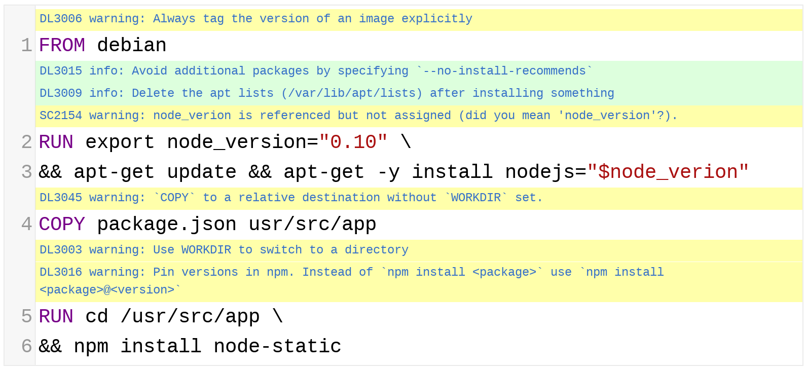

[![Linux/OSX Build Status][travis-img]][travis]
[![Windows Build status][appveyor-img]][appveyor]
[![GPL-3 licensed][license-img]][license]
[![GitHub release][release-img]][release]
[![Github downloads][downloads-img]]()


# Haskell Dockerfile Linter

A smarter Dockerfile linter that helps you build [best practice][] Docker
images. The linter is parsing the Dockerfile into an AST and performs rules on
top of the AST. It is standing on the shoulders of [ShellCheck][] to lint
the Bash code inside `RUN` instructions.

[:globe_with_meridians: **Check the online version on
 hadolint.github.io/hadolint**](https://hadolint.github.io/hadolint)
[](https://hadolint.github.io/hadolint)

## How to use

You can run `hadolint` locally to lint your Dockerfile.

```bash
hadolint <Dockerfile>
hadolint --ignore DL3003 --ignore DL3006 <Dockerfile> # exclude specific rules
hadolint --trusted-registry my-company.com:500 <Dockerfile> # Warn when using untrusted FROM images
```

Docker comes to the rescue to provide an easy way how to run `hadolint` on most
platforms.
Just pipe your `Dockerfile` to `docker run`:

```bash
docker run --rm -i hadolint/hadolint < Dockerfile
```

## Install

You can download prebuilt binaries for OSX, Windows and Linux from the latest
[release page][]. However, if it doesn't work for you, please fall back to
Docker, `brew` or source installation.

If you are on OSX you can use [brew](https://brew.sh/) to install `hadolint`.

```bash
brew install hadolint
```

On Windows you can use [scoop](https://github.com/lukesampson/scoop) to install `hadolint`.

```batch
scoop install hadolint
```

As shown before, `hadolint` is available as a Docker container:

```bash
docker pull hadolint/hadolint
```

If you need a Docker container with shell access, use the Debian variant of the
Docker image:

```bash
docker pull hadolint/hadolint:latest-debian
```

You can also build `hadolint` locally. You need [Haskell][] and the [stack][]
build tool to build the binary.

```bash
git clone https://github.com/hadolint/hadolint
cd hadolint
stack install
```

## Configure

`hadolint` supports specifying the ignored rules using a configuration file. The configuration
file should be in `yaml` format. This is one valid configuration file as an example:

```yaml
ignored:
  - DL3000
  - SC1010
```

Additionally, `hadolint` can warn you when images from untrusted repositories are being
used in Dockerfiles, you can append the `trustedRegistries` keys to the configuration
file as shown below:

```yaml
ignored:
  - DL3000
  - SC1010

trustedRegistries:
  - docker.io
  - my-company.com:5000
```

Configuration files can be used globally or per project. By default, `hadolint` will look for
a configuration file in the current directory with the name `.hadolint.yaml`

The global configuration file should be placed in the folder specified by `XDG_CONFIG_HOME`,
with the name `hadolint.yaml`. In summary, the following locations are valid for the configuration
file, in order or preference:

- `$PWD/.hadolint.yaml`
- `$XDG_CONFIG_HOME/hadolint.yaml`
- `~/.config/hadolint.yaml`

In windows, the `%LOCALAPPDATA%` environment variable is used instead of `XDG_CONFIG_HOME`

Additionally, you can pass a custom configuration file in the command line with
the `--config` option

```bash
hadolint --config /path/to/config.yaml Dockerfile
```

## Inline ignores

It is also possible to ignore rules by using a special comment directly above the Dockerfile
instruction you want to make an exception for. Ignore rule comments look like
`# hadolint ignore=DL3001,SC1081`. For example:

```dockerfile
# hadolint ignore=DL3006
FROM ubuntu

# hadolint ignore=DL3003,SC1035
RUN cd /tmp && echo "hello!"
```

Inline ignores will only work if place directly above the instruction.

## Integrations

To get most of `hadolint` it is useful to integrate it as a check to your CI
or to your editor to lint your `Dockerfile` as you write it. See our
[Integration][] docs.

## Rules

An incomplete list of implemented rules. Click on the error code to get more
detailed information.

-   Rules with the prefix `DL` originate from `hadolint`. Take a look at
`Rules.hs` to find the implementation of the rules.

-   Rules with the `SC` prefix originate from **ShellCheck** (Only the most
common rules are listed, there are dozens more)

Please [create an issue][] if you have an idea for a good rule.

| Rule                                                         | Description                                                                                                                                         |
|:-------------------------------------------------------------|:----------------------------------------------------------------------------------------------------------------------------------------------------|
| [DL3000](https://github.com/hadolint/hadolint/wiki/DL3000)   | Use absolute WORKDIR.                                                                                                                               |
| [DL3001](https://github.com/hadolint/hadolint/wiki/DL3001)   | For some bash commands it makes no sense running them in a Docker container like ssh, vim, shutdown, service, ps, free, top, kill, mount, ifconfig. |
| [DL3002](https://github.com/hadolint/hadolint/wiki/DL3002)   | Last user should not be root.                                                                                                                       |
| [DL3003](https://github.com/hadolint/hadolint/wiki/DL3003)   | Use WORKDIR to switch to a directory.                                                                                                               |
| [DL3004](https://github.com/hadolint/hadolint/wiki/DL3004)   | Do not use sudo as it leads to unpredictable behavior. Use a tool like gosu to enforce root.                                                        |
| [DL3005](https://github.com/hadolint/hadolint/wiki/DL3005)   | Do not use apt-get upgrade or dist-upgrade.                                                                                                         |
| [DL3006](https://github.com/hadolint/hadolint/wiki/DL3006)   | Always tag the version of an image explicitly.                                                                                                      |
| [DL3007](https://github.com/hadolint/hadolint/wiki/DL3007)   | Using latest is prone to errors if the image will ever update. Pin the version explicitly to a release tag.                                         |
| [DL3008](https://github.com/hadolint/hadolint/wiki/DL3008)   | Pin versions in apt-get install.                                                                                                                    |
| [DL3009](https://github.com/hadolint/hadolint/wiki/DL3009)   | Delete the apt-get lists after installing something.                                                                                                |
| [DL3010](https://github.com/hadolint/hadolint/wiki/DL3010)   | Use ADD for extracting archives into an image.                                                                                                      |
| [DL3011](https://github.com/hadolint/hadolint/wiki/DL3011)   | Valid UNIX ports range from 0 to 65535.                                                                                                             |
| [DL3012](https://github.com/hadolint/hadolint/wiki/DL3012)   | Provide an email address or URL as maintainer.                                                                                                      |
| [DL3013](https://github.com/hadolint/hadolint/wiki/DL3013)   | Pin versions in pip.                                                                                                                                |
| [DL3014](https://github.com/hadolint/hadolint/wiki/DL3014)   | Use the `-y` switch.                                                                                                                                |
| [DL3015](https://github.com/hadolint/hadolint/wiki/DL3015)   | Avoid additional packages by specifying --no-install-recommends.                                                                                    |
| [DL3016](https://github.com/hadolint/hadolint/wiki/DL3016)   | Pin versions in `npm`.                                                                                                                              |
| [DL3017](https://github.com/hadolint/hadolint/wiki/DL3017)   | Do not use `apk upgrade`.                                                                                                                           |
| [DL3018](https://github.com/hadolint/hadolint/wiki/DL3018)   | Pin versions in apk add. Instead of `apk add <package>` use `apk add <package>=<version>`.                                                          |
| [DL3019](https://github.com/hadolint/hadolint/wiki/DL3019)   | Use the `--no-cache` switch to avoid the need to use `--update` and remove `/var/cache/apk/*` when done installing packages.                        |
| [DL3020](https://github.com/hadolint/hadolint/wiki/DL3020)   | Use `COPY` instead of `ADD` for files and folders.                                                                                                  |
| [DL3021](https://github.com/hadolint/hadolint/wiki/DL3021)   | `COPY` with more than 2 arguments requires the last argument to end with `/`                                                                        |
| [DL3022](https://github.com/hadolint/hadolint/wiki/DL3022)   | `COPY --from` should reference a previously defined `FROM` alias                                                                                    |
| [DL3023](https://github.com/hadolint/hadolint/wiki/DL3023)   | `COPY --from` cannot reference its own `FROM` alias                                                                                                 |
| [DL3024](https://github.com/hadolint/hadolint/wiki/DL3024)   | `FROM` aliases (stage names) must be unique                                                                                                         |
| [DL3025](https://github.com/hadolint/hadolint/wiki/DL3025)   | Use arguments JSON notation for CMD and ENTRYPOINT arguments                                                                                        |
| [DL3026](https://github.com/hadolint/hadolint/wiki/DL3026)   | Use only an allowed registry in the FROM image                                                                                                      |
| [DL3027](https://github.com/hadolint/hadolint/wiki/DL3027)   | Do not use `apt` as it is meant to be a end-user tool, use `apt-get` or `apt-cache` instead                                                         |
| [DL3028](https://github.com/hadolint/hadolint/wiki/DL3028)   | Pin versions in gem install. Instead of `gem install <gem>` use `gem install <gem>:<version>`                                                       |
| [DL4000](https://github.com/hadolint/hadolint/wiki/DL4000)   | MAINTAINER is deprecated.                                                                                                                           |
| [DL4001](https://github.com/hadolint/hadolint/wiki/DL4001)   | Either use Wget or Curl but not both.                                                                                                               |
| [DL4003](https://github.com/hadolint/hadolint/wiki/DL4003)   | Multiple `CMD` instructions found.                                                                                                                  |
| [DL4004](https://github.com/hadolint/hadolint/wiki/DL4004)   | Multiple `ENTRYPOINT` instructions found.                                                                                                           |
| [DL4005](https://github.com/hadolint/hadolint/wiki/DL4005)   | Use `SHELL` to change the default shell.                                                                                                            |
| [DL4006](https://github.com/hadolint/hadolint/wiki/DL4006)   | Set the `SHELL` option -o pipefail before `RUN` with a pipe in it                                                                                   |
| [SC1000](https://github.com/koalaman/shellcheck/wiki/SC1000) | `$` is not used specially and should therefore be escaped.                                                                                          |
| [SC1001](https://github.com/koalaman/shellcheck/wiki/SC1001) | This `\c` will be a regular `'c'`  in this context.                                                                                                 |
| [SC1007](https://github.com/koalaman/shellcheck/wiki/SC1007) | Remove space after `=` if trying to assign a value (or for empty string, use `var='' ...`).                                                         |
| [SC1010](https://github.com/koalaman/shellcheck/wiki/SC1010) | Use semicolon or linefeed before `done` (or quote to make it literal).                                                                              |
| [SC1018](https://github.com/koalaman/shellcheck/wiki/SC1018) | This is a unicode non-breaking space. Delete it and retype as space.                                                                                |
| [SC1035](https://github.com/koalaman/shellcheck/wiki/SC1035) | You need a space here                                                                                                                               |
| [SC1045](https://github.com/koalaman/shellcheck/wiki/SC1045) | It's not `foo &; bar`, just `foo & bar`.                                                                                                            |
| [SC1065](https://github.com/koalaman/shellcheck/wiki/SC1065) | Trying to declare parameters? Don't. Use `()` and refer to params as `$1`, `$2` etc.                                                                |
| [SC1066](https://github.com/koalaman/shellcheck/wiki/SC1066) | Don't use $ on the left side of assignments.                                                                                                        |
| [SC1068](https://github.com/koalaman/shellcheck/wiki/SC1068) | Don't put spaces around the `=` in assignments.                                                                                                     |
| [SC1077](https://github.com/koalaman/shellcheck/wiki/SC1077) | For command expansion, the tick should slant left (\` vs ´).                                                                                        |
| [SC1078](https://github.com/koalaman/shellcheck/wiki/SC1078) | Did you forget to close this double-quoted string?                                                                                                  |
| [SC1079](https://github.com/koalaman/shellcheck/wiki/SC1079) | This is actually an end quote, but due to next char, it looks suspect.                                                                              |
| [SC1081](https://github.com/koalaman/shellcheck/wiki/SC1081) | Scripts are case sensitive. Use `if`, not `If`.                                                                                                     |
| [SC1083](https://github.com/koalaman/shellcheck/wiki/SC1083) | This `{/}` is literal. Check expression (missing `;/\n`?) or quote it.                                                                              |
| [SC1086](https://github.com/koalaman/shellcheck/wiki/SC1086) | Don't use `$` on the iterator name in for loops.                                                                                                    |
| [SC1087](https://github.com/koalaman/shellcheck/wiki/SC1087) | Braces are required when expanding arrays, as in `${array[idx]}`.                                                                                   |
| [SC1095](https://github.com/koalaman/shellcheck/wiki/SC1095) | You need a space or linefeed between the function name and body.                                                                                    |
| [SC1097](https://github.com/koalaman/shellcheck/wiki/SC1097) | Unexpected `==`. For assignment, use `=`. For comparison, use `[/[[`.                                                                               |
| [SC1098](https://github.com/koalaman/shellcheck/wiki/SC1098) | Quote/escape special characters when using `eval`, e.g. `eval "a=(b)"`.                                                                             |
| [SC1099](https://github.com/koalaman/shellcheck/wiki/SC1099) | You need a space before the `#`.                                                                                                                    |
| [SC2002](https://github.com/koalaman/shellcheck/wiki/SC2002) | Useless cat. Consider <code>cmd < file &#124; ..</code> or <code>cmd file &#124; ..</code> instead.                                                 |
| [SC2015](https://github.com/koalaman/shellcheck/wiki/SC2015) | Note that <code>A && B &#124;&#124; C</code> is not if-then-else. C may run when A is true.                                                         |
| [SC2026](https://github.com/koalaman/shellcheck/wiki/SC2026) | This word is outside of quotes. Did you intend to 'nest '"'single quotes'"' instead'?                                                               |
| [SC2028](https://github.com/koalaman/shellcheck/wiki/SC2028) | `echo` won't expand escape sequences. Consider `printf`.                                                                                            |
| [SC2035](https://github.com/koalaman/shellcheck/wiki/SC2035) | Use `./*glob*` or `-- *glob*` so names with dashes won't become options.                                                                            |
| [SC2039](https://github.com/koalaman/shellcheck/wiki/SC2039) | In POSIX sh, something is undefined.                                                                                                                |
| [SC2046](https://github.com/koalaman/shellcheck/wiki/SC2046) | Quote this to prevent word splitting                                                                                                                |
| [SC2086](https://github.com/koalaman/shellcheck/wiki/SC2086) | Double quote to prevent globbing and word splitting.                                                                                                |
| [SC2140](https://github.com/koalaman/shellcheck/wiki/SC2140) | Word is in the form `"A"B"C"` (B indicated). Did you mean `"ABC"` or `"A\"B\"C"`?                                                                   |
| [SC2154](https://github.com/koalaman/shellcheck/wiki/SC2154) | var is referenced but not assigned.                                                                                                                 |
| [SC2155](https://github.com/koalaman/shellcheck/wiki/SC2155) | Declare and assign separately to avoid masking return values.                                                                                       |
| [SC2164](https://github.com/koalaman/shellcheck/wiki/SC2164) | Use <code>cd ... &#124;&#124; exit</code> in case `cd` fails.                                                                                       |

## Develop

If you are an experienced Haskeller we would be really thankful if you would
tear our code apart in a review.

### Setup

1.  Clone repository

    ```bash
    git clone --recursive git@github.com:hadolint/hadolint.git
    ```

1.  Install the dependencies

    ```bash
    stack install
    ```

### REPL

The easiest way to try out the parser is using the REPL.

```bash
# start the repl
stack repl
# parse instruction and look at AST representation
parseString "FROM debian:jessie"
```

### Tests

Run unit tests.

```bash
stack test
```

Run integration tests.

```bash
./integration_test.sh
```

### AST

Dockerfile syntax is fully described in the [Dockerfile reference][]. Just take
a look at [Syntax.hs][] in the `language-docker` project to see the AST definition.

## Alternatives

- RedCoolBeans/[dockerlint](https://github.com/RedCoolBeans/dockerlint/)
- projectatomic/[dockerfile_lint](https://github.com/projectatomic/dockerfile_lint/)

<!-- References -->
[travis-img]: https://travis-ci.org/hadolint/hadolint.svg?branch=master
[travis]: https://travis-ci.org/hadolint/hadolint
[appveyor-img]: https://ci.appveyor.com/api/projects/status//github/hadolint/hadolint?svg=true&branch=master
[appveyor]: https://ci.appveyor.com/project/hadolint/hadolint/branch/master
[license-img]: https://img.shields.io/badge/license-GPL--3-blue.svg
[license]: https://tldrlegal.com/l/gpl-3.0
[release-img]: https://img.shields.io/github/release/hadolint/hadolint.svg
[release]: https://github.com/hadolint/hadolint/releases/latest
[downloads-img]: https://img.shields.io/github/downloads/hadolint/hadolint/total.svg
[best practice]: https://docs.docker.com/engine/userguide/eng-image/dockerfile_best-practices
[shellcheck]: https://github.com/koalaman/shellcheck
[release page]: https://github.com/hadolint/hadolint/releases/latest
[haskell]: https://www.haskell.org/platform/
[stack]: http://docs.haskellstack.org/en/stable/install_and_upgrade.html
[integration]: docs/INTEGRATION.md
[create an issue]: https://github.com/hadolint/hadolint/issues/new
[dockerfile reference]: http://docs.docker.com/engine/reference/builder/
[syntax.hs]: https://www.stackage.org/haddock/nightly-2018-01-07/language-docker-2.0.1/Language-Docker-Syntax.html
